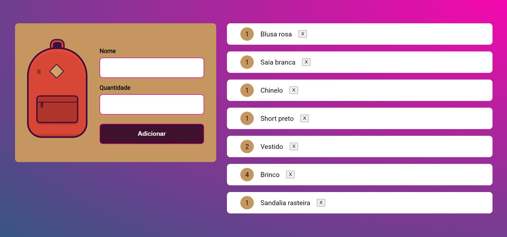

<h1 align='center'>O que levar ? 🎒 </h1>
<h3 align='center'>MOCHILA DE VIAGEM </h3>

  

 Projeto desenvolvido no curso de Javascript na Web: armazenando dados no navegador da plataforma Alura

## 💻Projeto

Criação de uma lista de itens que desejo levar na mochila, aqui é possivel registrar tudo que não pode esquecer na hora de montar a mochila para viagem. Caso ocorra alguma mudança de planos, é possível realizar a exclusão ou alteração do item inserido.

A mochila é um projeto da Tricia Akatz, [link](https://codepen.io/triciaakatz) e o código CSS e HTML foi disponibilizado pelo instrutor do curso.

📍  [Acesse aqui](mochila-de-viagem-gmlfsc07y-keniacunha.vercel.app)

